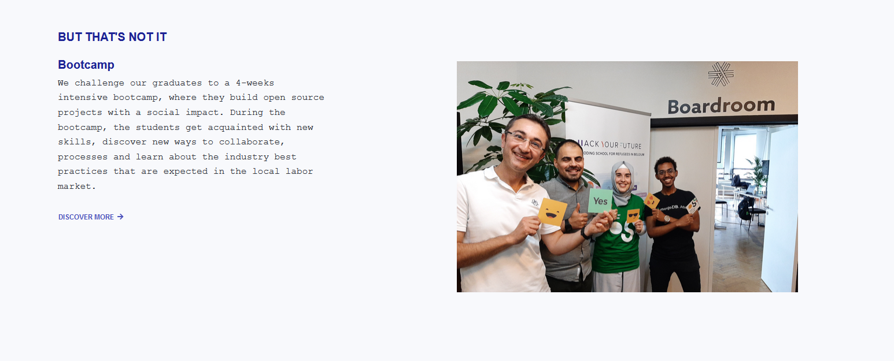

# Bootcamp

## HackYourFuture Open Innovation Bootcamp

The **Open Innovation Bootcamp** is a 1-month intensive aiming to get newly arrived talent acquainted with the skills, collaboration, processes and industry best practices expected in a Belgian software organisation by working on real-world, open source projects with social impact. 

**In a nutshell, the Open Innovation Bootcamp is:**

* 4-week intensive bootcamp for refugees
* Coaching given by IT-experts
* Open source projects with a positive impact
* Career starter in the Belgian IT industry

### **What are the goals of the Open Innovation Bootcamp?**

* Put the technical skills into practice while working on an open source project
* Learn to collaborate and work in teams
* Learn to scope a project and hold client meetings
* Be the bridge between a technical 8-month training at HackYourFuture Belgium and the local labour market

**Have a look at the calendar on the following page to find out more information!**

