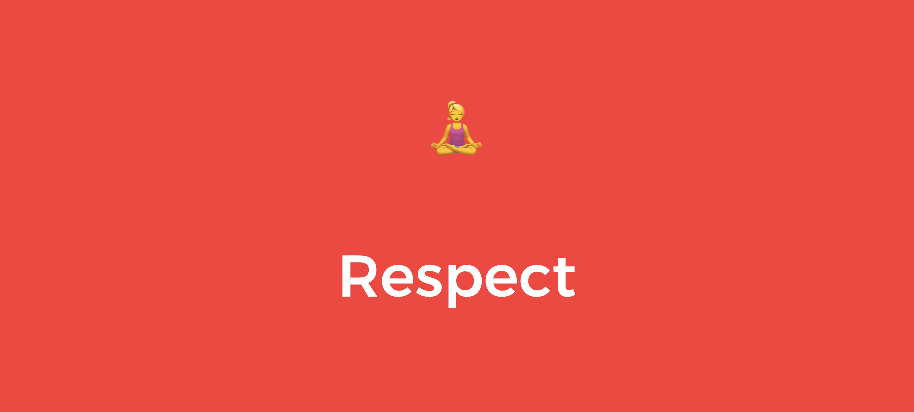

# Code of Conduct

As part of the HackYourFuture Community, everyone involved in the Bootcamp pledges to make participation in our community a harassment-free experience for everyone, regardless of age, body size, visible or invisible disability, ethnicity, sex characteristics, gender identity and expression, level of experience, education, socio-economic status, nationality, personal appearance, race, religion, or sexual identity and orientation.

We pledge to act and interact in ways that contribute to an open, welcoming, diverse, inclusive, and healthy community.

### Our standards

Examples of behavior that contributes to a positive environment for our community include: 

* Demonstrating empathy and kindness toward other people nguage or imagery, and sexual attention or advances of any kind
* Trolling, insulting or derogatory comments, and personal or political attacks
* Public or private harassment
* Publishing others’ private information, such as a physical or email address, without their explicit permission
* Other conduct which could reasonably be considered inappropriate in a professional setting   

### Enforcement

Instances of abusive, harassing, or otherwise unacceptable behavior may be reported to the coordinators responsible for enforcement \(made known at the beginning of the bootcamp\). All complaints will be reviewed and investigated promptly and fairly. Any reporters will remain anonymous.

### Attribution

This Code of Conduct is adapted from the Contributor Covenant, version 2.0, available at [https://www.contributor-covenant.org/version/2/0/code\_of\_conduct.html](https://www.contributor-covenant.org/version/2/0/code_of_conduct.html). Community Impact Guidelines were inspired by Mozilla’s code of conduct enforcement ladder.

For answers to common questions about this code of conduct, see the FAQ at [https://www.contributor-covenant.org/faq](https://www.contributor-covenant.org/faq). Translations are available at [https://www.contributor-covenant.org/translations](https://www.contributor-covenant.org/translations).

