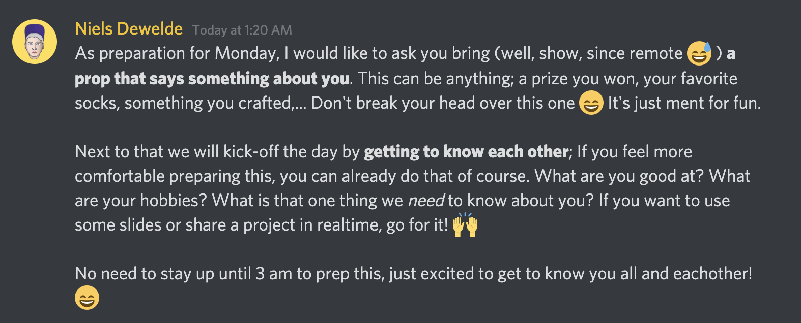

# 1: Get to know your team

## Decide on how you're going to break the ice with your students

The first day is awkward. In the afternoon, the teams get assembled, and you'll get to know each other.

Gather the team you're leading. Play a game or have a list of questions available so you can get to know each other. 

**Some examples:**

* Let your team members take a prop with them that says something about themselves. This requires informing them beforehand.
* Let your team members make a short presentation of things they've made in school \(and outside school, something they're proud of\). This requires informing them beforehand.
* Prepare a list of questions that can break the ice
  * What's your name?
  * What is your top skill?
  * What is your favourite food?
  * What is _the one thing_ we should know about you?

## Decide on project management and structure

How are you going to guide your students day to day? Some examples to take care of:

* Where do you track your todo's?
  * Post-its, Trello, Kanban, GitHub?
* How will you track your todo's?
  * Decide who will teach the students
  * Decide on structure:
    * Backlog, To-do, In Progress, Blocked, In Review, Done?
  * Do you need labels?
    * Field: Back-end, Front-end, Design, Copy ...
    * Type: Enhancement, bug, question
    * Priority: High, medium, low, wont-fix ...
    * State of todo: Todo, In Progress, Blocked, To review, "Bad issue" \(not well-written, nobody understands\), question, invalid, duplicate, help wanted, ...
* Where do you track issues?
  * GitHub? Kanban?
* Will you let your non-devs work in GitHub as well? Who teaches them?

## Decide on how you're going to do scoping sessions and retrospects

Weekly scoping sessions and retrospects are crucial to finding out what you're going to build something, and if you're doing well as a team.

At the end of the bootcamp you'll also give feedback to each individual, which you can prepare together. You can write some positive notes on a postcard too!

If you need any techniques, please contact the coordination team of HackYourFuture Belgium, they are working on it now!

### 

