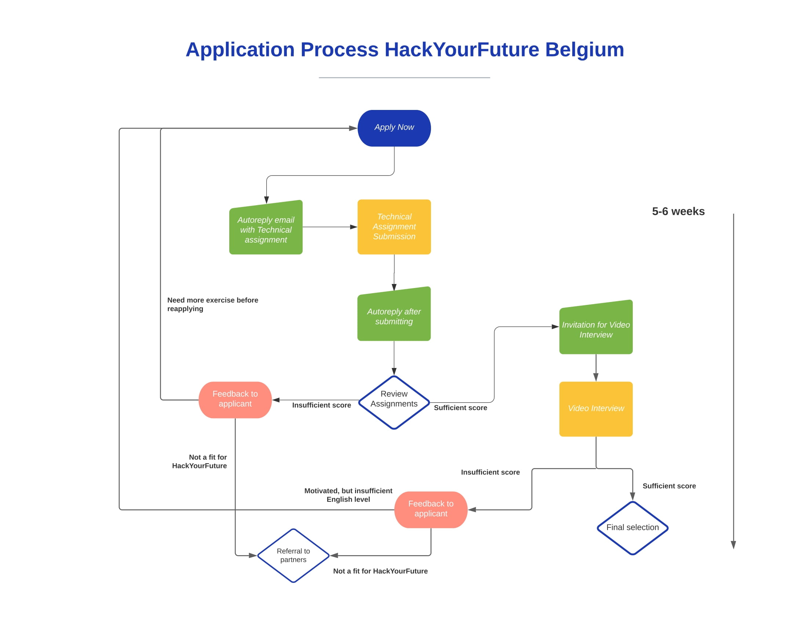

# Application

[<< Top](./README.md) | [Precourse >>](../precourse/README.md)

> I never understood the desire to formally equate skill at mathematics with skill at programming. While being a math wonk certainly won't _hurt_ you as a programmer, it's very hard for me to draw a direct line from "good at math" to "good at programming".
>
> - [Jeff Atwood](https://blog.codinghorror.com/should-competent-programmers-be-mathematically-inclined/)

---

At HackYourFuture we’re looking for people who work very hard, are **disciplined and passionate** about learning how to code and becoming a maker.

For us **motivation is key**, as our program is difficult and you are expected to learn a lot and very quickly. Moreover, we are looking for people who are self-motivated and willing to support their fellow classmates. This is because HackYourFuture is a school that is based on \_self-directed \_and \_peer-assisted \_learning.

In our program you will spend a lot of time solving problems and coding on their own during the week (with online guidance from highly skilled coaches) and classes take place on Sundays. You will spend quite some time trying to figure concepts out on your own.

This is done on purpose. All these skills you have to develop during the program are what will ultimately make you a great developer. And you will see a lot of joy comes with improving these skills. We promise.

To make sure you are the right fit for our program, we are asking you to do a technical assignment. This assignment consists of online exercises and a small website you will build. No worries, you will learn how to make a basic website during this test. The test’s goal is that you can show us:

1. You are able to familiarize yourself with new concepts quickly, by searching, asking for hel or following coding tutorials.
2. You are willing to put in time, effort and are motivated to learn how to code.
3. You show that you have the potential to become a creative maker.

**Let’s get started -> [Deliverables](./deliverables.md)**

## Learning Objectives

- 🥚 **Writing Markdown**: You can write an understandable and structured document using GitHub flavor Markdown. Your code should be well-formatted and should contain no spelling mistakes.
- 🥚 **Using GitHub**: You can create a GitHub account and set up a profile README. This includes creating a new repository with the correct name, editing+previewing markdown, committing changes, and configuring the repository to appear on your account.
- 🥚 **Writing HTML & CSS**: You can create a simple web page of their own design using only HTML & CSS. The web page can be very simple but should be coherent, their code should be well-formatted, inline styles should be avoided, and they should include comments in all files explaining their process. (this will be done in a web-based programming environment)
- 🥚 **Explaining JS Variables**: You can write a clear JavaScript file explaining how variables work. Your code should use only a small subset of language features (`'use strict'`, comments, logs, `let` variables, strings and string concatenation). Variables should be well-named, logs should be helpful, the file should be clearly commented, and it should run (unless the intention is to demonstrate a specific error). (this will be done in a web-based programming environment)

---

## Applying

> If you are studying this course alone, with a group, or through another organization, no worries! You can complete the technical assignment from the application process and move on to the Precourse at your own pace.

So you want to become a HackYourFuture student? You can apply when our call for applications is open.

The **application process** will consist of the following steps:

1. **Submit your initial application** using the **Apply Now** button on our landing page: [www.hackyourfuture.be](https://www.hackyourfuture.be).
2. You will receive an e-mail with instructions and information about how to complete the next step, **our** _**technical assignment**_.
3. Complete and submit your technical assignment! You will need access to **a computer** with an **internet connection**, but it does not need to be your own. Everything can be completed with online accounts. The technical assignment doesn't require past experience with programming.
4. If you showed strong motivation in your application and did well on your technical assignment, you will be invited for **a video interview**. Here we can get to know each other and figure out if HackYourFuture is a good fit for you. An **intermediate level of English** is required to start our program, so we'll assess this as well during the interview.. In case you won't be invited for a video interview, we will give you specific feedback.
5. After all applicants have had their interviews, we will get back to you with **an email stating whether you are accepted** for our next class. If HackYourFuture isn't the best fit for you \(yet\), we can help you find an organisation that will be or lead you to one of our partners, aiming to facilitate the integration of newcomers in Belgium.

_PS. You aren't required to join an Intro Session before applying to HackYourFuture._

> For the next application deadlines, keep an eye on [our website](https://hackyourfuture.be), [twitter](https://twitter.com/HackYFutureBE) or [Facebook](https://www.facebook.com/HackYFutureBE/).

