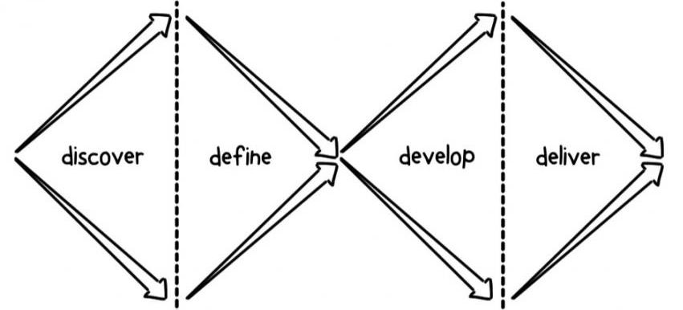

# 4. UX/UI Design

[&lt;&lt; Agile Development](../agile-development/README.md) \| [Top](../README.md) \| [Welcome to JS &gt;&gt;](../welcome-to-js/README.md)

---

[examples, exercises and guides](https://github.com/HackYourFutureBelgium/ux-ui-design)

---

Computers run code, developers maintain it, and humans use it. This module focuses on the humans who use it and the developers who maintain it.

You will learn about _Design Thinking_ and _User Empathy_ by designing a home page for one of your classmates that they will develop. The main objective is to understand your classmate and help them to build the home page they need. Along the way you will explore the world of Open Source Software by contributing to your classmates home pages.

## Learning Objectives

- 🥚 **User Empathy**: You understand what user empathy is, and can use it to understand a classmate's needs and help them plan a home page.
- 🥚 **Design Cycle**: You will be able to describe the design cycle and what steps you will take in each state (Empathize, define, ideate, prototype, testing and implement).
- 🥚 **Double Diamond**: You can separate the design and deliver phases of a project. Design and delivery are a never-ending cycle, but it helps to be clear when you are focusing one or the other.
- 🥚 **Stakeholder Interviews**: You can interview another student to learn their motivations, needs, and blocks
- 🥚 **Rapid Prototyping**: You can use rapid prototyping techniques (such as paper prototyping) to test initial design hypotheses and receive user feedback.
- 🥚 **User Journeys**: You can write user journeys for websites that you use.
- 🐣 **Design Principles**: You can apply some of the key design principles to your own site, such as alignment, proximity, contrast, balance and space.
- 🐣 **Accessible Design**: You will be able to make a website design more accessible.
- 🐣 **CSS**: You can use CSS3 to implement responsive & accessible designs.
- 🐣 **Open Source Software**: You understands the principles of open licensing and can make a contribution to a classmate's home page.
- 🐥 **Web Accessibility**: You can navigate a web page using a screen reader, and can use _semantic elements_ and _ARIA labels_ to make your web pages accessible.
- 🐥 **Figma**: You can create, share and collaborate on a website design using Figma.

<!-- from coaches, to place:

expand/collapse

 

### Research, Definition

- You will be able to decide when quantitative data is necessary or when qualitative data is necessary, and how to collect both types of data.
- You will be able to conduct some user research to understand user needs, motivations and pain points. Such as user Interview and a user survey.
- You will understand how to interpret quantitative and qualitative data.
- You will be able to use the user research data gathered to define the problem that you need to solve and write a hypothesis on a potential solution.
- You will use your research findings and initial rapid prototyping to map the user journeys for your websites

### Ideate

- You will learn the basics of using a component library

-->
